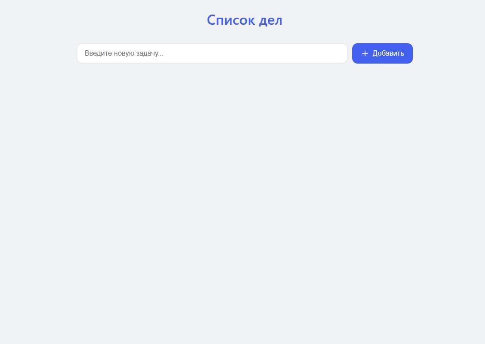
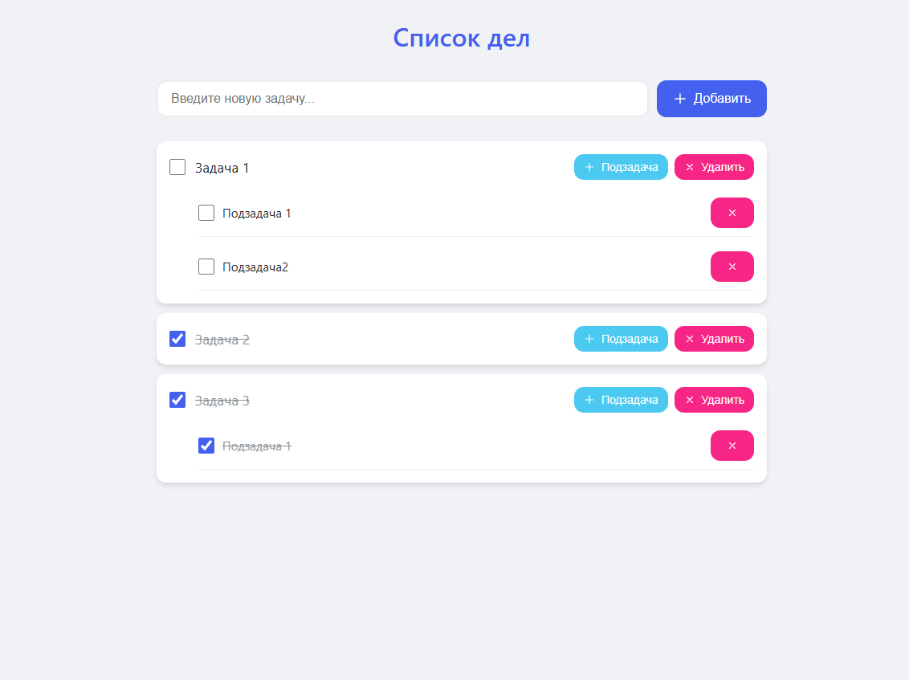

# 📝 To-Do List Application

## 📌 Описание

Это веб-приложение для управления списком задач с возможностью создания подзадач. Приложение позволяет:

- ✅ Создавать, просматривать, обновлять и удалять задачи
- ➕ Добавлять подзадачи к основным задачам
- ✔️ Отмечать задачи как выполненные/невыполненные
- 🔄 Автоматически отмечать все подзадачи как выполненные при завершении основной задачи

[](https://youtu.be/haU_l_Shyhw)

*Кликните для просмотра демонстрации*

## 🛠 Технологии

**Backend:**
- PHP 7.4+
- MySQL 5.7+

**Frontend:**
- HTML5, CSS3
- Vanilla JavaScript
- Адаптивный дизайн

**База данных:**
- MySQL с таблицей tasks

## ⚙️ Установка

1. Склонируйте репозиторий:
   ```
   bash git clone https://github.com/deyatele/todo-list
   ```
2. Настройте базу данных:

* Создайте БД todo_list
* Импортируйте структуру из файла database.sql

3. Настройте подключение к БД в файле db.php:
```
private $host = 'localhost';
private $db_name = 'todo_list';
private $username = 'ваш_пользователь';
private $password = 'ваш_пароль';
```
4. Разместите файлы на веб-сервере (Apache, Nginx)

## 🖥 Использование
1. Откройте приложение в браузере

2. Добавьте новую задачу через поле ввода

3. Для добавления подзадачи нажмите "Добавить подзадачу"

4. Отмечайте задачи выполненными с помощью чекбоксов

5. Удаляйте задачи кнопкой "Удалить"

## ✨ Особенности 
* 🎨 Плавные CSS-анимации при добавлении/удалении задач

* 📱 Адаптивный интерфейс для мобильных устройств

* 🔒 Защита от SQL-инъекций

* 🛡 Валидация входных данных

* 🔄 Каскадное обновление статусов подзадач

## 🔌 API Endpoints
* GET /api.php/tasks - Получить все задачи
* POST /api.php/tasks - Создать новую задачу
* PUT /api.php/tasks/{id} - Обновить задачу
* DELETE /api.php/tasks/{id} - Удалить задачу

<table>
  <tr>
    <td align="center">
      
    </td>
    <td align="center">
      
    </td>
  </tr>
</table>

## 📄 Лицензия
MIT License
